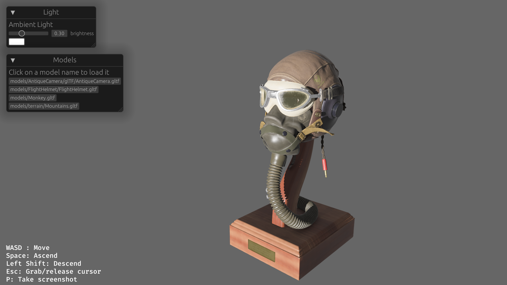

# Bevy Model Viewer

## Description

This project is a really simple GLTF model viewer that I built while I was learning the basics of the [Bevy game](https://bevyengine.org/) engine and the Rust programming language.

### Features
- Render a GLTF model (currently only models placed at the assets/models directory)
- Fly Camera with [bevy_flycam](https://github.com/sburris0/bevy_flycam)
    - Controls: WASD to move around, Left Shift to descend, Space to ascend
- Save a screenshot to the disk by pressing P



## Installation

To install this project, you will need to have Rust and Cargo installed. You can install them from the [official website](https://www.rust-lang.org/tools/install).
If you are on Linux, you need to install the following dev dependencies:
```bash
sudo apt-get install --no-install-recommends libasound2-dev libudev-dev libgtk-3-dev
```

Once Rust and Cargo are installed, you can clone this repository and build the project with:
```bash
git clone https://github.com/caioteixeira/bevy_model_viewer.git
cd project
cargo build --release
```

You can just run the project with cargo as well
```bash
cargo run
```

## Contributing
Contributions are welcome! Please fork this repository and open a pull request with your changes.

### Desired features
- [] Open GLTF files in arbitrary paths in the file system (not sure if possible due to the asset processing routines of Bevy's asset system)
- [] Additional lighting controls on the UI
- [] Play animations contained on GLTF files
- [] Add additional models

## License
This project is licensed under the MIT License.